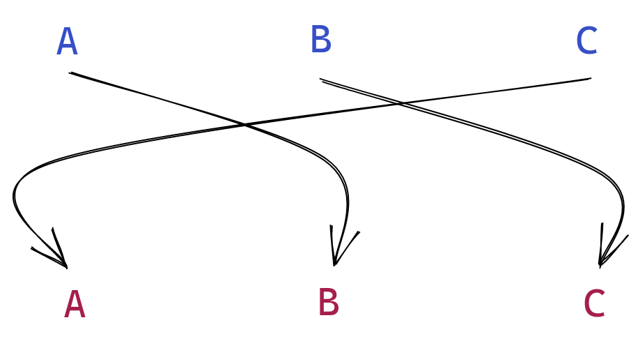

# Level Three

## Puzzle

A substitution cipher is a bit like a spaghetti diagram.



The arrows that determine which letter in the input (the message) goes to which letter in the output (the ciphertext). Here's a toy example.

```
message : CAB
key     : (A -> B, B -> C, C-> A)
cipher  : ABC
```

We'll refer to this `key` as a *substitution table*. In this example, there are 3 entries in the substitution table (for `A`, `B`, and `C`). In the puzzle, there are 26 entries in the alphabet (one for each letter of the alphabet). Brute forcing this one is tough. There are `26!` possible substitution tables. You're going to have to be a little more thoughtful

The message in `puzzle.txt` has been encrypted in this way. You have to decrypt it!

## Solving

### `solve()`

Write your code within the `solve()` function. The puzzle has been automatically read in for you, and saved as `puzzletext`
```python
def solve():
    puzzletext = read_puzzle()

    # Your code goes here! #
    
    return plaintext # Save your answer in this variable

```

### Helpers

#### `helper.write_line_to_file()`

You can use `helper.write_line_to_file()` to write some text out to a file in case you want to look at it later.

```python
# Example usage
my_string = 'Hello Level 4'
helper.write_line_to_file(my_string)
```

When you call this function, the string you pass as a parameter will be written to `scratchpad.txt`

#### `helper.print_puzzle_stats()`

You can use `helper.print_puzzle_stats()` to display some interesting statistics about the puzzle.

```python
# Example usage
puzzletext = read_puzzle()
helper.print_puzzle_stats(puzzletext)
```

When you call this function, the stats will be printed to the screen.

#### `helper.SubstitutionTable()`

One of the parameters to the `encrypt()` function is a python `dict`. The helper provides a custom version of the standard `dict` equipped with some functions you may find useful. 
```python
# Example usage
substitution_table = helper.SubstitutionTable()

# Create a substitution from 'A' to 'B'
substitution_table['A'] = 'B'

# print the table
substitution_table.print_table()

# read in a mapping to the substitution table
my_mapping_file = 'guess.txt'
substitution_table.read_in_table(my_mapping_file)
```


*Hint: The letters may have changed, but the english language has been pretty much the same for a fair while now*